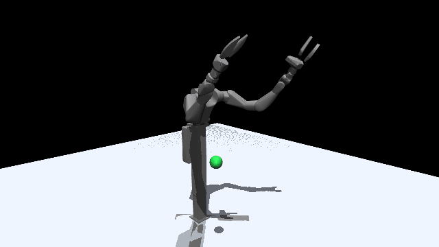

# vega_curobo

GPU motion planning for the [Dexmate Vega 1U](https://www.dexmate.ai) humanoid upper body,
using cuRobo for the solving and MuJoCo for the simulation. The planner and the
simulator load the same URDF, so there is no second robot model to keep in sync.



Two demos, one for each half of the problem:

| | solver | solve time | use |
|---|---|---|---|
| `scripts/reach.py` | `MotionPlanner` | ~12 s | one collision-free trajectory to a fixed pose |
| `scripts/follow_ball.py` | `ModelPredictiveControl` | ~0.3 s | servo toward a goal that keeps moving |

That difference is the whole reason both exist. A global planner produces a
better trajectory but cannot chase anything at 12 seconds a solve; MPC re-solves
fast enough to follow, but only refines a short horizon from where it already is.

## Requirements

Solving needs **cuRoboV2 and a CUDA GPU**. cuRoboV2 is not on PyPI; you need a
build of it on your machine, and the demos import `curobo.motion_planner` and
`curobo.model_predictive_control` from it.

Everything else is ordinary:

```
pip install -r requirements.txt
```

Developed on a Jetson Orin (aarch64, CUDA 12.6) with MuJoCo 3.9 and PyTorch 2.7.
All timings below are from that board, which is slow; a desktop GPU will do
better.

## Running

```
python scripts/reach.py --mode frames                  # -> media/reach.mp4
python scripts/reach.py --mode live                    # interactive window
python scripts/reach.py --target 0.6 -0.3 1.2

python scripts/follow_ball.py --mode frames --balls 6  # -> media/follow_ball.mp4
python scripts/follow_ball.py --mode live
```

`--mode frames` renders offscreen through EGL and writes an mp4. Prefer it on
Jetson, where the interactive viewer intermittently segfaults on the board's GL
driver.

## Layout

```
assets/vega.urdf          repaired URDF, relative mesh paths
assets/meshes/            33 collision meshes
configs/vega_right.yml    generated cuRobo config: spheres, self-collision, locked joints
vega_curobo/config.py     paths, tool frame, reachable box, floor obstacle
vega_curobo/scene.py      MuJoCo scene, lights, camera, mp4/window recording
vega_curobo/solvers.py    planner and MPC construction, goals, stepping
scripts/build_config.py   regenerate the robot config from a URDF (~8 min sphere fit)
scripts/relax_self_collision.py  ignore link pairs that overlap at rest
```

The active chain is `Lift`, `torso_flip`, `R_arm_j1..j7`, `R_gripper_j1`. The
left arm and head are locked.

## Notes

Things that cost real time to work out, kept here so they cost you less.

**A floor at z=0 makes every solve fail.** The Vega stands at the URDF origin, so
a ground plane at z≈0 intersects the base collision spheres. The start state is
in collision and cuRobo reports every plan infeasible, but IK still converges
with zero position and rotation error, so it reads as a solver bug rather than a
scene bug. Keep the floor clear of the base (`config.FLOOR` sits at z=-0.5). To
diagnose this class of failure, dump the constraints directly:

```python
metrics = planner.ik_solver.metrics_rollout.compute_metrics_from_action(q.view(1, 1, -1))
print(metrics.costs_and_constraints.constraints.names)
print(metrics.costs_and_constraints.constraints.values)
```

**MuJoCo deletes visual-only geoms from a URDF.** `MjSpec.from_file()` on a URDF
sets `compiler.discardvisual = 1`, which drops every geom with
`contype=0/conaffinity=0` at compile time. Any marker or ground plane you add
programmatically disappears: the body survives with `geomnum == 0`, so nothing
errors and the scene just renders empty. `scene.py` sets it back to 0.

**The tool frame does not exist in MuJoCo.** `R_ee` is a massless fixed link, and
the MuJoCo compiler merges those away, so `data.body("R_ee")` raises. To compare
the two engines, reconstruct it from `R_arm_l7` and the fixed transforms. Done
that way, cuRobo and MuJoCo agree on the tool position to 1e-4 mm, which is the
check worth running whenever the URDF changes.

**MPC warm-start iterations dominate the solve.** At the default the controller
took 2422 ms per solve on the Orin, slower than the one-shot planner it was meant
to replace. `warm_start_optimization_num_iters=25` brings that to 312 ms with no
visible loss of tracking. The value must be a multiple of the optimizer's
`inner_iters` (25 here), so 25 is the floor; anything smaller raises.

**One solve returns a horizon, so render all of it.** Advancing to the last state
and drawing one frame animates at the solve rate and looks like a slideshow.
Drawing every step of `action_sequence.position[0]` puts the frame rate at
roughly four times the solve rate for the same motion.

**Do not lock the left arm at 0.0.** Zero is not a neutral pose for this robot:
it straightens the tucked left arm into the right arm's workspace, and plans then
start in self-collision. Lock unused joints at their builder defaults, which is
what `build_config.py` does.

**Not every pose in the reachable box is reachable at any orientation.** The
7-DoF arm cannot hold an arbitrary tool orientation across the workspace. The box
in `config.py` was sampled at the home orientation and hit 40/40; change the
orientation and you need rejection sampling or a fallback.

**Interpolated plans use a different joint ordering.** `get_interpolated_plan()`
returns all 21 joints, including locked ones, ordered differently from
`planner.joint_names`. Pass a state through `planner.kinematics.get_active_js`
before any forward kinematics, or it raises on the joint-name mismatch.

## License

MIT
