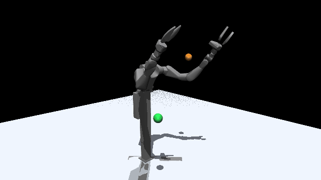
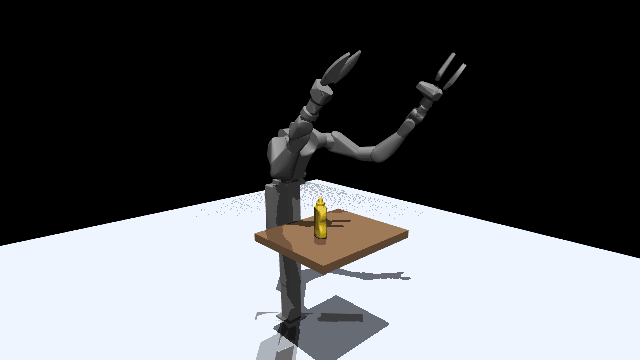
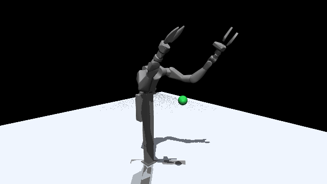
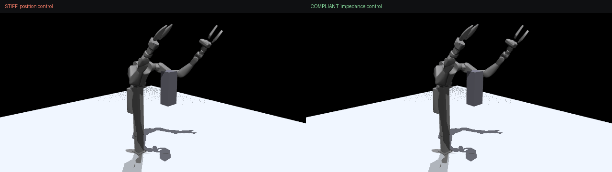
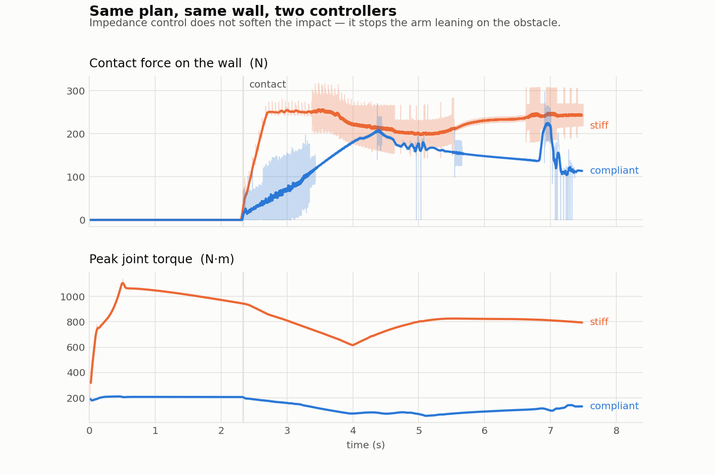

# vega_curobo

GPU motion planning for the [Dexmate Vega 1U](https://www.dexmate.ai) humanoid
upper body: cuRobo solves, MuJoCo simulates, and both load the same URDF so there
is no second robot model to keep in sync.



| demo | what it shows |
|---|---|
| [`reach.py`](scripts/reach.py) | one collision-free trajectory to a pose, one arm or two |
| [`follow_ball.py`](scripts/follow_ball.py) | chasing a goal that keeps moving, one arm or two |
| [`pick_mustard.py`](scripts/pick_mustard.py) | pick an object off a table, set it down elsewhere |
| [`track_gic.py`](scripts/track_gic.py) | *executing* a plan with torques, under gravity |
| [`compliance.py`](scripts/compliance.py) | what stiff and compliant control do when they hit something |

## Quick start

```
pip install -r requirements.txt

python scripts/reach.py --mode frames                 # -> media/reach.mp4
python scripts/follow_ball.py --arms both --balls 4
python scripts/pick_mustard.py --mode frames
python scripts/track_gic.py --mode frames
python scripts/compliance.py && python scripts/plot_compliance.py
```

`--mode frames` renders offscreen through EGL to an mp4; `--mode live` opens a
window. Prefer `frames` on Jetson, where the interactive viewer intermittently
segfaults on the board's GL driver.

Solving needs **cuRoboV2 and a CUDA GPU**. cuRoboV2 is not on PyPI, so you need a
build of it on your machine; everything else installs normally. Developed on a
Jetson Orin (aarch64, CUDA 12.6) with MuJoCo 3.9 and PyTorch 2.7 — all timings
here are from that board, which is slow.

## Planner or controller

The two solvers are not interchangeable, and picking the wrong one is the easiest
way to lose an afternoon.

| | 1 arm | 2 arms | good for |
|---|---|---|---|
| `MotionPlanner` | ~12 s | ~125 s | a whole trajectory, planned once |
| `ModelPredictiveControl` | ~0.3 s | ~0.9 s | a goal that keeps moving |

The global planner gives the better trajectory but cannot chase anything at 12
seconds a solve. MPC re-solves fast enough to follow, but only refines a short
horizon from where it already is. They also scale very differently to two arms: a
second tool constraint costs MPC 3x and the global search 10x.

Bimanual is not two controllers. Both hands are goals on one kinematic chain, so
a single solve coordinates them and the shared torso joints are in the same
optimisation.

## Grasping



`pick_mustard.py` runs approach, grasp, lift, carry, place, retract. No waypoint
in it is typed in: the approach direction is searched for, the tool goal comes
from the measured jaw offset, and the bottle is attached to the robot for the
carry so the plan accounts for what it is holding. All six segments reach their
goal to 0.00 mm and under 0.05 deg.

## Executing a plan



The other demos write joint angles into qpos, which is a way of saying "assume a
controller". `track_gic.py` runs one: torques from the SE(3) tracking error drive
the arm along a planned trajectory with gravity on. It holds a pose to 0.26 mm
and tracks a trajectory to 8.7 mm mean.

The point is compliance, not accuracy — a position servo would beat those numbers
and then fight the first thing it touched. This is the layer a force-regulated
contact task gets built on.

Control law from Seo et al., [arXiv:2504.17080](https://arxiv.org/abs/2504.17080)
([GUFIC_mujoco](https://github.com/Joohwan-Seo/GUFIC_mujoco)).

### Why bother



`compliance.py` puts a wall in the arm's path *after* planning, so neither
controller knows it is there, and runs the identical trajectory twice.



| after contact | stiff | compliant |
|---|---|---|
| sustained force on the wall | 242 N | 143 N |
| mean joint torque | 786 N·m | 109 N·m |

Impedance control does **not** soften the impact — the peak is 318 N against
298 N, set by approach speed and inertia, not by the controller. What it changes
is everything after: the stiff controller's error is in joint space, so being
blocked just grows the correction and it leans on the wall at 786 N·m
indefinitely. The impedance controller's error is a spatial spring, so the force
is bounded by how far it has been pushed and it settles at a seventh of the
torque.

## Layout

```
assets/                   repaired URDF, 33 collision meshes, YCB mustard bottle
configs/vega_right.yml    generated cuRobo config: spheres, self-collision, locked joints
vega_curobo/config.py     paths, tool frames, reachable box, floor obstacle
vega_curobo/scene.py      MuJoCo scene, lights, camera, recording, physics mode
vega_curobo/solvers.py    planner and MPC construction, goals, stepping, attachment
vega_curobo/grasp.py      grasp poses from the measured jaw offset, feasibility search
vega_curobo/control.py    geometric impedance control on SE(3)
scripts/                  the five demos, the plot, config regeneration
```

The active chain is `Lift`, `torso_flip`, `R_arm_j1..j7`, `R_gripper_j1`, with the
left arm and head locked. `--arms both` unlocks the left arm and adds `L_ee` as a
second tool frame, taking it to 18 joints.

## Notes

**[docs/NOTES.md](docs/NOTES.md)** collects what actually cost time: why a floor
at z=0 makes every solve fail, what MuJoCo silently deletes from a URDF, why
grasp feasibility must be checked with the object disabled, and why the nullspace
posture term ships switched off. Most of it presents as a solver bug and is not
one — worth a read before debugging in the wrong place.

## License

MIT, except the robot assets. `assets/` is redistributed from
[dexmate-ai/dexmate-urdf](https://github.com/dexmate-ai/dexmate-urdf),
Copyright 2025 Dexmate Inc., under the Apache License 2.0, and includes the
mustard bottle from the [YCB](https://www.ycbbenchmarks.com) object set. See
[`assets/NOTICE`](assets/NOTICE).
